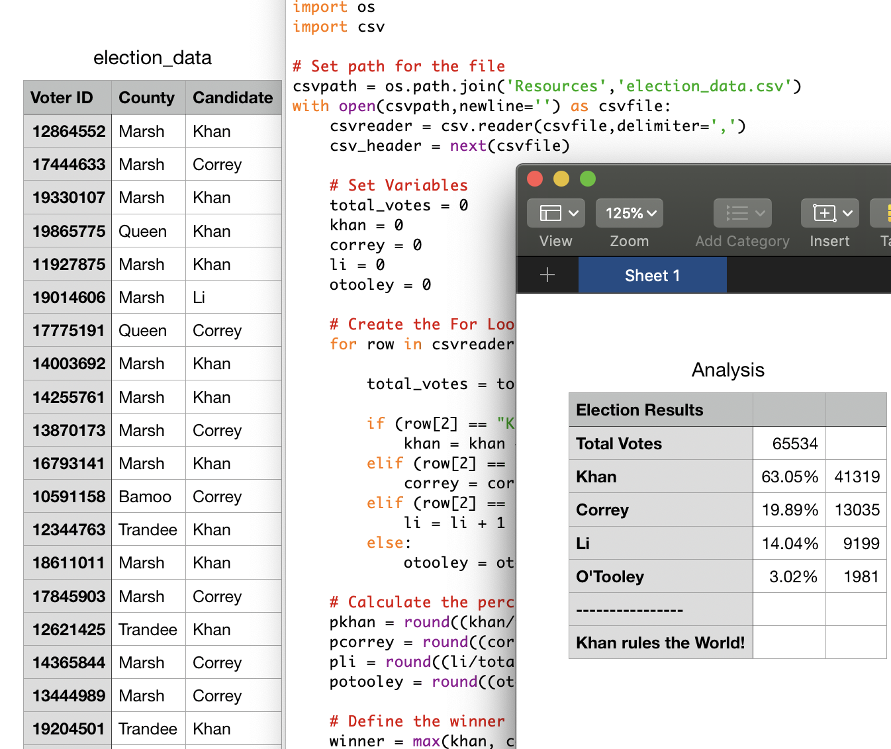
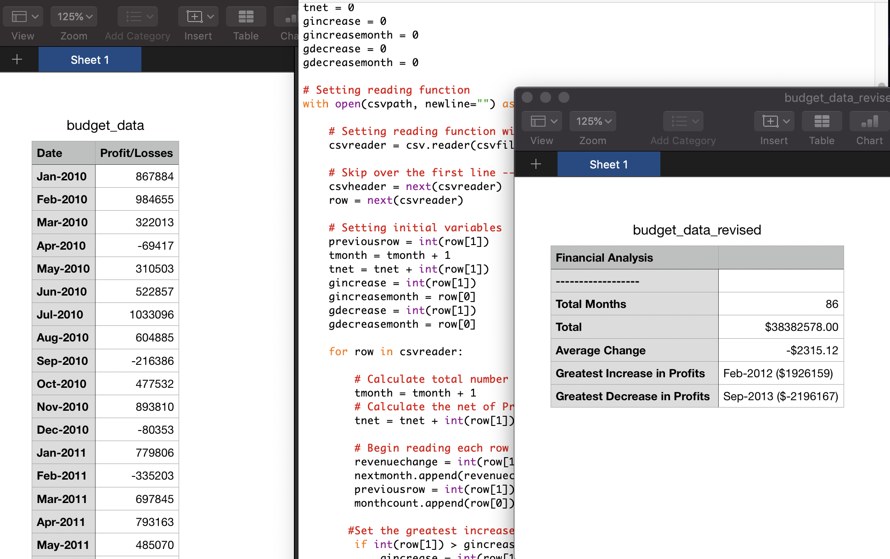

# Project Preview
# READING AND ANALYZING DATA WITH PYTHON

As an introduction to Python coding, this project analyzes two separate data sets and tests my ability to parse the information to solve subsequent questions. This project uses various beginner level Python skills such as reading CSV files, developing For Loops, and more.
-----------------------------------------------------------------------------------------------------------

-----------------------------------------------------------------------------------------------------------

-----------------------------------------------------------------------------------------------------------
